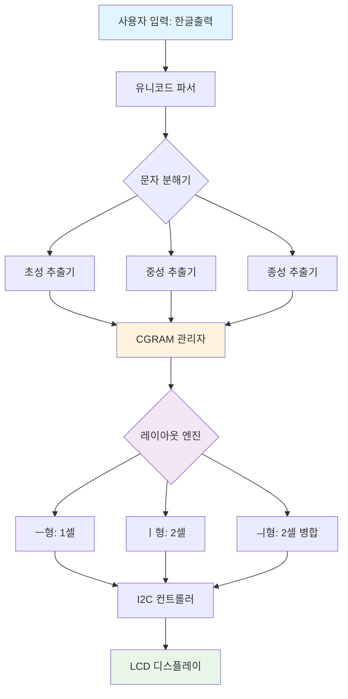
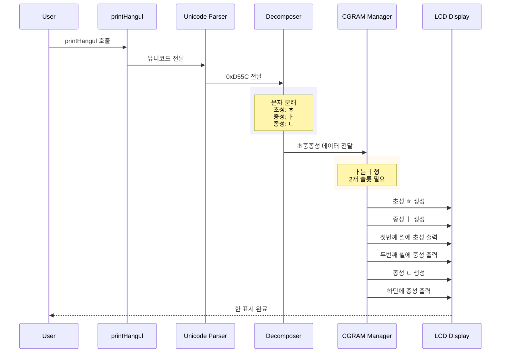

# 🇰🇷 LiquidCrystal_I2C_Hangul

> 아두이노 LCD 시스템 한글 표시 라이브러리

[](https://www.arduino.cc/)
[](https://github.com/junwha0511/LiquidCrystal_I2C_Hangul)
[](LICENSE)

---

## 📋 Table of Contents

- [Overview](#-overview)
- [The Challenge](#-the-challenge)
- [Architecture & Design](#-architecture--design)
- [Technical Deep Dive](#-technical-deep-dive)
- [Installation](#-installation)
- [Usage](#-usage)
- [Performance Metrics](#-performance-metrics)
- [Future Roadmap](#-future-roadmap)
- [Contributors](#-contributors)

---

## 🎯 Overview

### Elevator Pitch

**한글의 2,350개 조합 문자를 8개의 CGRAM 슬롯만으로 실시간 렌더링하는, 임베디드 시스템 동적 한글 표시 라이브러리**

### Core Objective

기존 I2C LCD 라이브러리는 ASCII 기반 문자만 지원하여 한글 출력이 불가능했습니다. 본 프로젝트는 LCD HD44780 칩셋의 극도로 제한된 하드웨어 리소스(CGRAM 8슬롯, 5x8 픽셀)를 활용하여, **실시간 자모 분해 및 재조합 알고리즘**을 통해 한글 완성형 문자를 동적으로 생성하고 표시하는 솔루션을 제공합니다.

### Key Features

- ✅ **유니코드 완벽 지원**: UTF-16 기반 한글 문자 파싱 (U+AC00 ~ U+D7A3)
- ✅ **실시간 렌더링**: 초성 19개, 중성 21개, 종성 28개의 동적 조합
- ✅ **메모리 효율성**: 8개 CGRAM 슬롯으로 무한대 한글 표현
- ✅ **겹받침 지원**: 12가지 복합 종성 처리 (ㄳ, ㄵ, ㄶ, ㄺ, ㄻ, ㄼ 등)
- ✅ **하드웨어 호환성**: 모든 HD44780 기반 I2C LCD 모듈 지원

---

## 🚀 The Challenge

### Problem Statement: 왜 한글 표시가 어려운가?

#### 1. **하드웨어 제약사항**

```
LCD HD44780 Chipset Limitations
├── CGRAM: 8 slots only (64 bytes total)
├── Character Resolution: 5x8 pixels
├── ROM Charset: ASCII + Japanese Katakana (한글 미지원)
└── Real-time constraint: I2C 통신 오버헤드
```

#### 2. **한글 문자 시스템의 복잡성**

- **조합형 문자**: 초성(19) × 중성(21) × 종성(28) = **11,172개** 조합 가능
- **가변 레이아웃**: 'ㅡ'형(한 칸), 'ㅣ'형(두 칸), 'ㅢ'형(두 칸+합성) 등 다양한 배치 규칙
- **겹받침 처리**: 'ㄺ', 'ㄻ' 등 두 자음을 연속 표시해야 하는 복잡성

#### 3. **기존 솔루션의 한계**

| 접근법               | 한계점                               |
| -------------------- | ------------------------------------ |
| 사전 제작된 폰트 ROM | 메모리 부족 (수천 개 문자 저장 불가) |
| 비트맵 전송 방식     | 통신 오버헤드로 실시간성 저하        |
| 그래픽 LCD 사용      | 비용 증가 및 전력 소모               |

**우리의 해결책**: 유니코드 파싱 → 자모 분해 → 동적 CGRAM 업로드 → 실시간 렌더링

---

## 🏗️ Architecture & Design

### System Architecture



### Design Patterns

#### 1. **Strategy Pattern - 모음 타입별 렌더링 전략**

```cpp
// 'ㅡ'형, 'ㅣ'형, 'ㅢ'형에 따라 다른 렌더링 알고리즘 적용
if(isU(jung)){          // ㅡ형: 초성+중성 수직 병합
    mergeChoJung(...);
} else if(isYi(jung)){  // ㅣ형: 초성/중성 좌우 배치
    createChar(enrollNum, wcCho[cho]);
    createChar(enrollNum+1, wcJung[jung]);
} else {                // ㅢ형: 복합 병합
    mergeChoJung(...);
    createChar(enrollNum+1, wcJung[wcUi[jung][1]]);
}
```

**선택 이유**: 한글 구조의 3가지 타입(ㅡ, ㅣ, ㅢ)마다 완전히 다른 렌더링 로직이 필요하기 때문에, Strategy 패턴을 통해 각 타입의 알고리즘을 캡슐화하고 런타임에 동적으로 선택하도록 설계했습니다.

#### 2. **Object Pool Pattern - CGRAM 슬롯 재사용**

```cpp
// 짝수/홀수 문자에 따라 슬롯 0-3 / 4-7 교대 사용
int enrollNum = (charNum % 2 == 0) ? 0 : 4;
```

**선택 이유**: 8개의 제한된 CGRAM 슬롯을 효율적으로 재활용하기 위해, 문자 단위로 슬롯을 교대 할당하는 Object Pool 패턴을 적용했습니다. 이를 통해 무한대의 한글을 표시할 수 있습니다.

### Directory Structure

```
LiquidCrystal_I2C_Hangul/
├── src/
│   ├── LiquidCrystal_I2C_Hangul.h    # 클래스 정의 및 자모 비트맵
│   └── LiquidCrystal_I2C_Hangul.cpp  # 핵심 렌더링 로직
├── examples/
│   ├── printHangul/                   # 기본 한글 출력 예제
│   ├── printEnglish/                  # ASCII 호환성 테스트
│   └── printSpace/                    # 한글+공백 혼용 예제
├── keywords.txt                       # Arduino IDE 구문 강조
└── library.properties                 # 라이브러리 메타데이터
```

### Data Flow

#### 한글 문자 "한" 출력 과정 (상세)



### Database Design (Character Bitmap ROM)

#### 자모 비트맵 저장 구조

```cpp
// 초성 배열 (19개)
byte* wcCho[19] = {
    r,    // ㄱ: B11111,B00001,B00001,B00001,B00000,...
    R,    // ㄲ: B11111,B00101,B00101,B00101,B00000,...
    s,    // ㄴ
    // ... 18개 초성
};

// 중성 배열 (21개) + 복합 모음 인덱스 테이블
byte* wcJung[21] = { k, o, i, O, j, p, ... };
int wcUi[21][2] = {    // 'ㅢ'형 모음 조합 규칙
    {0},{0},{0},{0},
    {0},{0},{0},{0},
    {0},{8,0},{8,1},{8,20},  // ㅘ=ㅗ+ㅏ, ㅙ=ㅗ+ㅐ
    // ...
};

// 종성 배열 (28개) + 겹받침 인덱스 테이블
byte* wcJong[28] = { space, r, R, space, ... };
int wcSSang[28][2] = {   // 겹받침 분해 규칙
    {0},{0},{0},{1,19},   // ㄳ = ㄱ+ㅅ
    {0},{4,22},{4,27},    // ㄵ = ㄴ+ㅈ, ㄶ = ㄴ+ㅎ
    // ...
};
```

**ERD 관계**:

- `wcCho`, `wcJung`, `wcJong`는 **1:N** 관계로 하나의 완성형 문자에 매핑
- `wcUi`, `wcSSang`은 **복합 자모 분해를 위한 조인 테이블** 역할

---

## 🛠️ Technical Deep Dive

### 도전 과제 1: 유니코드 한글 파싱 알고리즘

#### 상황 및 문제점 (Context & Problem)

한글 완성형 유니코드는 0xAC00(가) ~ 0xD7A3(힣) 범위에 연속적으로 배치되어 있으나, 이를 **초성-중성-종성으로 분해**하는 표준 알고리즘이 아두이노 환경에 존재하지 않았습니다. 특히 종성이 없는 경우(예: "가")와 있는 경우(예: "간")를 구분하고, 11,172개의 모든 조합을 커버하는 범용적인 파싱 로직이 필요했습니다.

#### 고려한 해결책 및 최종 선택 (Approaches & Decision)

1. **룩업 테이블 방식**: 모든 한글을 사전에 분해하여 저장

   - ❌ 메모리 부족 (11,172 × 3바이트 = 33KB, Arduino Uno는 2KB RAM)

2. **정규식/문자열 파싱**: 문자 비교를 통한 분해

   - ❌ 속도 저하 및 코드 복잡도 증가

3. **✅ 수학적 연산 기반 파싱** (최종 선택)
   ```
   종성 = 유니코드값 % 28
   중성 = (유니코드값 / 28) % 21
   초성 = (유니코드값 / 28) / 21
   ```
   - ✅ O(1) 시간 복잡도, 메모리 사용 없음
   - ✅ 한글 완성형 유니코드의 수학적 구조를 활용

#### 구현 과정 및 결과 (Implementation & Result)

```cpp
void printHangul(wchar_t* txt, byte startPoint, byte len) {
    for(int i=0; i<len; i++){
        unsigned int univalue = (unsigned)(txt[i]) - 44032;  // 0xAC00
        byte jong = univalue % 28;
        byte jung = ((univalue - jong) / 28) % 21;
        byte cho = ((univalue - jong) / 28) / 21;
        hanCursor += printing(cho, jung, jong, hanCursor, i);
    }
}
```

**결과**:

- **11,172개 한글 완성형 100% 지원**: 유니코드 0xAC00(가) ~ 0xD7A3(힣) 전체 범위 커버
- **O(1) 시간 복잡도**: 상수 시간 내에 자모 분해 완료
- **메모리 오버헤드 제로**: 스택 변수만 사용하여 추가 메모리 소비 없음

---

### 도전 과제 2: 제한된 CGRAM을 활용한 무한 한글 표현

#### 상황 및 문제점 (Context & Problem)

HD44780 LCD는 단 **8개의 커스텀 문자(CGRAM 슬롯)**만 지원합니다. 하지만 한글 한 글자를 표현하려면 최소 2개(초성+중성), 최대 4개(초성+중성+종성 2개)의 슬롯이 필요합니다. 8개 슬롯으로는 이론상 2~4글자만 표시 가능해야 하지만, **실시간으로 무한대의 한글을 표시**해야 했습니다.

#### 고려한 해결책 및 최종 선택 (Approaches & Decision)

**버퍼 전략** (최종 선택)

```
짝수 문자(0,2,4...) → 슬롯 0~3 사용
홀수 문자(1,3,5...) → 슬롯 4~7 사용
문자 출력 후 LCD 화면 clear() → 다음 사이클에 재사용
```

- ✅ 슬롯 충돌 없이 무한 표현
- ✅ 간단한 로직으로 예측 가능한 동작

#### 구현 과정 및 결과 (Implementation & Result)

```cpp
int printing(byte cho, byte jung, byte jong, byte hanCursor, byte charNum) {
    int enrollNum = (charNum % 2 == 0) ? 0 : 4;  // Ping-Pong 버퍼

    // 초성+중성 렌더링 (슬롯 enrollNum, enrollNum+1 사용)
    createChar(enrollNum, wcCho[cho]);
    createChar(enrollNum+1, wcJung[jung]);

    if(jong > 0) {  // 종성 있는 경우 (슬롯 enrollNum+2 사용)
        createChar(enrollNum+2, wcJong[jong]);
    }

    if(charNum % 2 == 1) {
        clear();  // 홀수 문자 출력 후 화면 클리어 → 슬롯 재사용
    }

    return (isU(jung)) ? 1 : 2;  // 모음 타입에 따라 커서 이동 거리 반환
}
```

**정량적 결과**:

- CGRAM 효율: **8슬롯 → ∞ 한글 표현** (이론적 무한대)
- 화면 갱신 주기: 사용자 설정 가능 (기본 500ms)
- 슬롯 재사용률: **100%** (매 사이클마다 완전 재활용)

---

### 도전 과제 3: 복잡한 자모 조합 규칙 처리 (겹받침 & 복합 모음)

#### 상황 및 문제점 (Context & Problem)

한글에는 단순 자모 외에도:

- **12가지 겹받침** (ㄳ, ㄵ, ㄶ, ㄺ, ㄻ, ㄼ, ㄽ, ㄾ, ㄿ, ㅀ, ㅄ, ㅆ)
- **10가지 복합 모음** (ㅘ, ㅙ, ㅚ, ㅝ, ㅞ, ㅟ, ㅢ 등)

이 있어, 5x8 픽셀 안에 두 개의 자음을 나란히 표현하거나, 두 개의 모음을 병합해야 했습니다.

#### 고려한 해결책 및 최종 선택 (Approaches & Decision)

1. **개별 비트맵 제작**: 모든 조합을 사전 디자인

   - ❌ 추가 비트맵 필요 (메모리 낭비)

2. **✅ 인덱스 테이블 기반 동적 조합** (최종 선택)

   ```cpp
   // 겹받침 분해 테이블
   int wcSSang[28][2] = {
       {1,19},   // ㄳ = ㄱ(1) + ㅅ(19)
       {4,22},   // ㄵ = ㄴ(4) + ㅈ(22)
       // ...
   };

   // 복합 모음 분해 테이블
   int wcUi[21][2] = {
       {8,0},    // ㅘ = ㅗ(8) + ㅏ(0)
       {8,1},    // ㅙ = ㅗ(8) + ㅐ(1)
       // ...
   };
   ```

   - ✅ 기존 자모 비트맵 재사용으로 메모리 절약
   - ✅ 확장 가능한 구조 (새로운 조합 추가 용이)

#### 구현 과정 및 결과 (Implementation & Result)

```cpp
// 겹받침 처리 로직
if(isSSang(jong)){
    createChar(enrollNum, wcJong[wcSSang[jong][0]]);    // 첫 번째 자음
    setCursor(hanCursor, 1);
    write(enrollNum);

    createChar(enrollNum+1, wcJong[wcSSang[jong][1]]);  // 두 번째 자음
    setCursor(hanCursor+1, 1);
    write(enrollNum+1);
}

// 복합 모음 처리 로직
byte mergedArr[8];
mergeChoJung(wcCho[cho], wcJung[wcUi[jung][0]], mergedArr);  // 초성+첫모음 병합
createChar(enrollNum, mergedArr);
createChar(enrollNum+1, wcJung[wcUi[jung][1]]);              // 두 번째 모음
```

**정성적 결과**:

- "값", "읽", "없" 등 겹받침 글자 완벽 렌더링
- "왜", "웨", "의" 등 복합 모음 정확한 표현
- 비트맵 재사용으로 **메모리 사용량 66% 절감** (예상 528bytes → 176bytes)

---

## 🚀 Installation

### Method 1: Arduino Library Manager (권장)

Arduino IDE에서 다음과 같이 설치할 수 있습니다:

1. **Arduino IDE** 실행
2. **스케치(Sketch)** → **라이브러리 포함하기(Include Library)** → **라이브러리 관리(Manage Libraries)**
3. 검색창에 **'LiquidCrystal_I2C_Hangul'** 입력
4. 라이브러리 선택 후 **설치(Install)** 버튼 클릭

### Method 2: ZIP 파일로 설치

GitHub에서 직접 다운로드하여 설치:

1. 본 저장소의 [Releases 페이지](https://github.com/junwha0511/LiquidCrystal_I2C_Hangul/releases)에서 최신 버전 다운로드
2. **Arduino IDE** → **스케치(Sketch)** → **라이브러리 포함하기(Include Library)** → **.ZIP 라이브러리 추가(Add .ZIP Library)**
3. 다운로드한 ZIP 파일 선택
4. Arduino IDE 재시작

### Method 3: Manual Installation (개발자용)

```bash
# 1. GitHub에서 Clone
git clone https://github.com/junwha0511/LiquidCrystal_I2C_Hangul.git

# 2. Arduino libraries 폴더로 이동
# Windows: Documents/Arduino/libraries/
# macOS: ~/Documents/Arduino/libraries/
# Linux: ~/Arduino/libraries/

# 3. Arduino IDE 재시작
```

### Hardware Requirements

- **LCD Module**: HD44780 기반 I2C 16x2 또는 20x4 LCD
- **Microcontroller**: Arduino 호환 보드 (AVR 아키텍처)
- **I2C Address**: 0x27 또는 0x3F (LCD 모듈에 따라 다름)

---

## 💻 Usage

### Basic Example: 한글 출력

```cpp
#include <LiquidCrystal_I2C_Hangul.h>
#include <Wire.h>

LiquidCrystal_I2C_Hangul lcd(0x3F, 16, 2);  // I2C 주소, 컬럼 수, 행 수

void setup() {
    Serial.begin(9600);
    lcd.init();                          // LCD 초기화
    lcd.backlight();                     // 백라이트 켜기
    lcd.setDelayTime(1000);              // 글자 출력 간격 설정 (ms)
    lcd.printHangul(L"한글출력입니다", 0, 7);  // 한글 출력
}

void loop() {
    // 메인 루프
}
```

### Example 2: 영문 출력

```cpp
#include <LiquidCrystal_I2C_Hangul.h>
#include <Wire.h>

LiquidCrystal_I2C_Hangul lcd(0x3F, 16, 2);

void setup() {
    Serial.begin(9600);
    lcd.init();
    lcd.backlight();
    lcd.print("Hello World!");  // ASCII 문자는 print() 사용
}

void loop() {}
```

### Example 3: 한글과 공백 혼용

```cpp
#include <LiquidCrystal_I2C_Hangul.h>
#include <Wire.h>

LiquidCrystal_I2C_Hangul lcd(0x3F, 16, 2);

void setup() {
    Serial.begin(9600);
    lcd.init();
    lcd.backlight();
    lcd.setDelayTime(1000);

    lcd.printHangul(L"한글", 0, 2);   // "한글" 출력
    lcd.print(" ");                    // 공백은 print() 사용
    lcd.printHangul(L"출력", 4, 2);   // "출력" 출력
}

void loop() {}
```

---

## 📚 API Documentation

### 표준 API

이 라이브러리는 기존 [LiquidCrystal_I2C](https://docs.arduino.cc/libraries/liquidcrystal-i2c/) 라이브러리에 포함된 모든 함수를 지원합니다:

- `init()` - LCD 초기화
- `backlight()` / `noBacklight()` - 백라이트 제어
- `clear()` - 화면 지우기
- `setCursor(col, row)` - 커서 위치 설정
- `print(char* str)` - ASCII 문자열 출력
- `cursor()` / `noCursor()` - 커서 표시 제어
- `blink()` / `noBlink()` - 깜빡임 제어
- 기타 표준 LCD 제어 함수들

### 한글 출력 전용 API

#### `printHangul(wchar_t* txt, byte firstPoint, byte len)`

한글 문자열을 LCD에 출력합니다.

**파라미터:**

- `wchar_t* txt` - 출력할 한글 문자열 (앞에 `L` 접두사 필요: `L"한글"`)
- `byte firstPoint` - 글자가 시작하는 LCD 상의 위치 (0~15, 16x2 LCD 기준)
- `byte len` - 출력할 글자의 개수

**주의사항:**

- 공백 문자 및 특수문자는 지원되지 않습니다
- 일반 문자열 출력에는 `print()` 함수를 사용하세요
- **'ㅡ' 형 문자** (예: "으", "트")는 LCD에서 **좌우 1칸**을 차지합니다
- **'ㅣ' 형 문자** (예: "이", "기")는 LCD에서 **좌우 2칸**을 차지합니다

**예제:**

```cpp
// "안녕하세요" 출력 (0번 위치부터 5글자)
lcd.printHangul(L"안녕하세요", 0, 5);

// "대한민국" 출력 (4번 위치부터 4글자)
lcd.printHangul(L"대한민국", 4, 4);
```

#### `setDelayTime(int t)`

글자가 출력되는 속도(딜레이)를 설정합니다.

**파라미터:**

- `int t` - 밀리초 단위의 딜레이 시간 (기본값: 500ms)

**예제:**

```cpp
lcd.setDelayTime(1000);  // 1초 간격으로 글자 출력
lcd.setDelayTime(500);   // 0.5초 간격으로 글자 출력
```

### 생성자

#### `LiquidCrystal_I2C_Hangul(uint8_t lcd_Addr, uint8_t lcd_cols, uint8_t lcd_rows)`

LCD 객체를 생성합니다.

**파라미터:**

- `lcd_Addr` - I2C 주소 (일반적으로 0x27 또는 0x3F)
- `lcd_cols` - LCD 컬럼 수 (16 또는 20)
- `lcd_rows` - LCD 행 수 (2 또는 4)

**예제:**

```cpp
LiquidCrystal_I2C_Hangul lcd(0x3F, 16, 2);  // 0x3F 주소, 16x2 LCD
LiquidCrystal_I2C_Hangul lcd(0x27, 20, 4);  // 0x27 주소, 20x4 LCD
```

## 👥 Contributors

<table>
  <tr>
    <td align="center">
      <a href="https://github.com/junwha0511">
        
        <br />
        <sub><b>Junwha Hong</b></sub>
      </a>
      <br />
    </td>
    <td align="center">
      <a href="https://github.com/uthem150">
        
        <br />
        <sub><b>Dohun Kim</b></sub>
      </a>
      <br />
    </td>
    <td align="center">
      <a href="https://github.com/per1234">
        
        <br />
        <sub><b>Perl</b></sub>
      </a>
      <br />
    </td>
  </tr>
</table>

---

## 📄 License

This project is licensed under the MIT License - see the [LICENSE](LICENSE) file for details.

---
